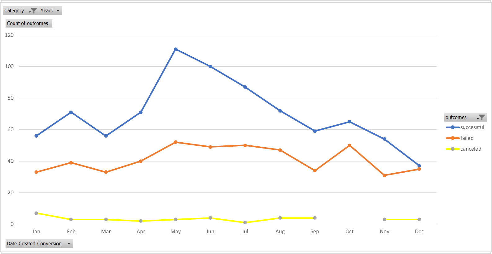
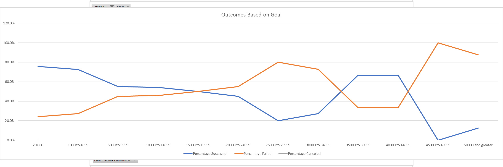

# An Analysis of Kickstarter Campaigns
Module 1 of Data Analytics Bootcamp

## Scope
The goal of this project was to take a spreadsheet containing data on various kickstarter campaigns and, using Microsoft Excel, analyze the data therein. The analysis was in service of the client, Louise, who sought to kickstart a play and wanted to know how best to maximize the chance of the project being successfully funded.

## Analysis
The analysis focused on two variables and each of their correlations to the success of the campaign. The first variable analyzed was the month the campaign was launched: 

The graph above shows that more campaigns are started between April and August than during the other months. It also shows that campaigns started in these months have a better chance of being successfully funded. Both of these effects are most pronounced during the month of May. Conversely, December has the fewest campaigns started, and also the greatest likelihood of failure.

The second variable analyzed was the goal of the campaign, the amount of funding it sought to raise:

The graph above shows that play-funding campaigns seeking less than $1000 have the highest likelihood of success. Success rates drop slowly until the price tag hits $5000, and continues dropping until a price of $25000, after which success rates rise again, such that both the $35000-$39999 and $40000-$44999 ranges have almost the same success rate as a $5000 campaign.

